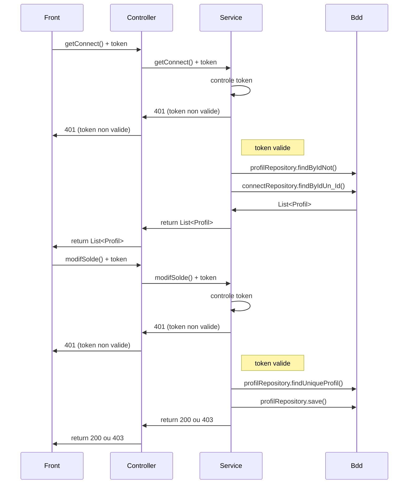
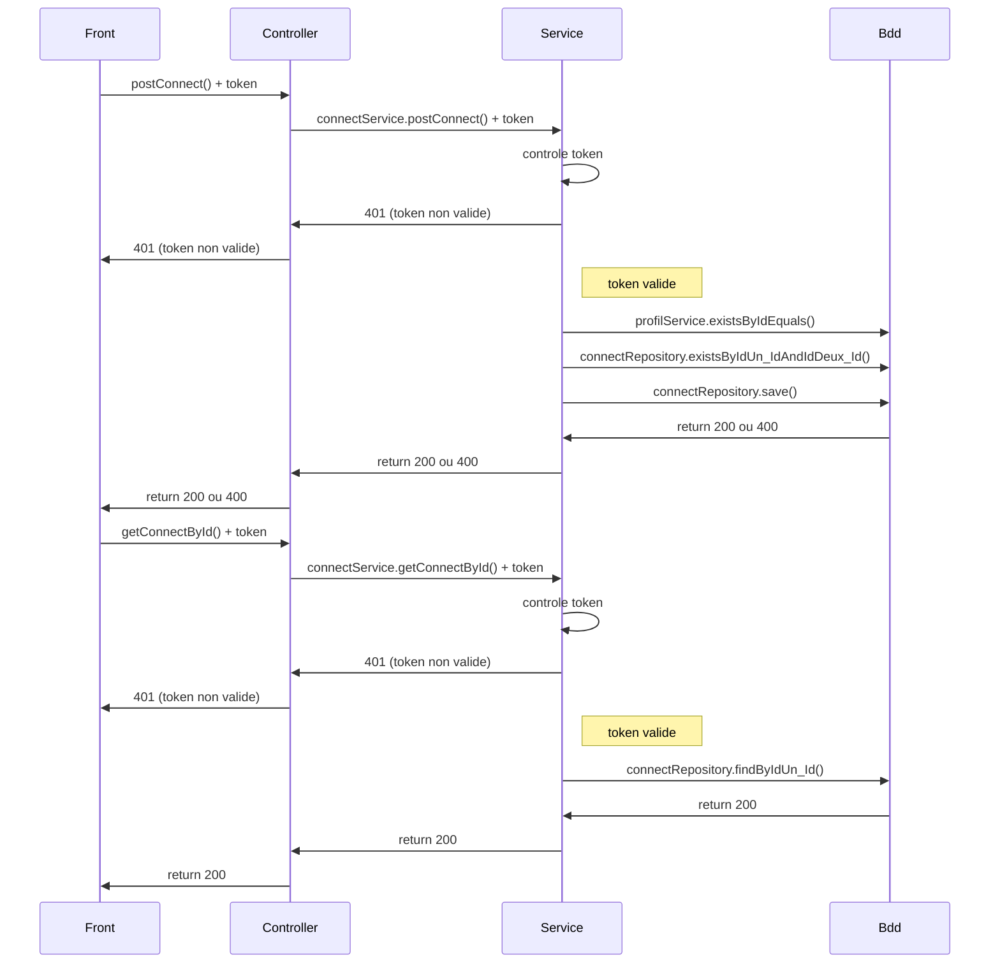
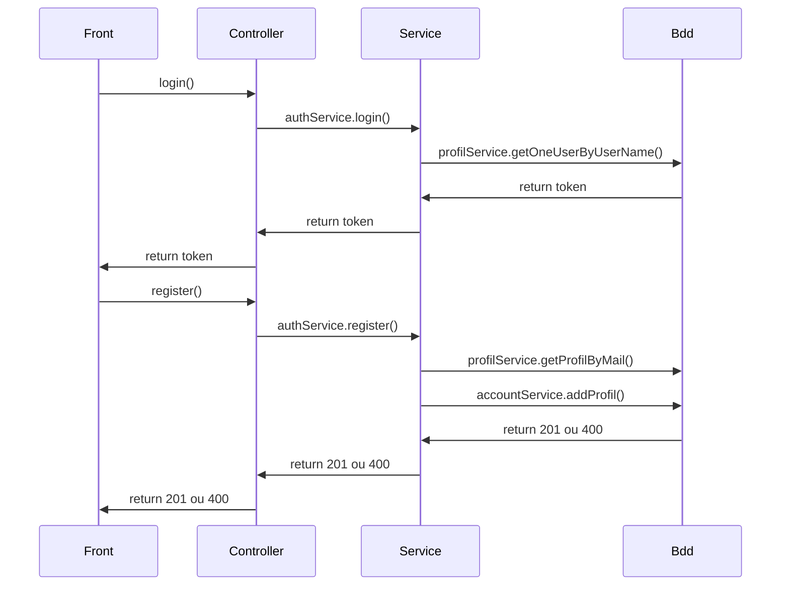
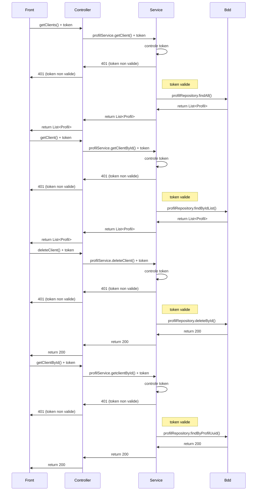
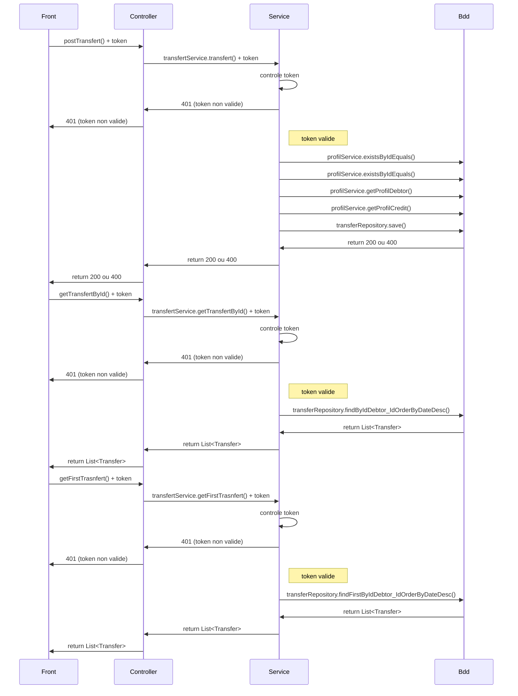

# PayMyBuddy 

PayMyBuddy est un projet 'springboot' dont le but est faire des transaction entre amis.

## Getting Started

These instructions will get you a copy of the project up and running on your local machine for development and testing purposes. See deployment for notes on how to deploy the project on a live system.

### Prerequisites

What things you need to install the software and how to install them

- Java 1.8
- Maven 3.6.2
- Mysql 8.0.17

### Installing

A step by step series of examples that tell you how to get a development env running:

1.Install Java:

https://docs.oracle.com/javase/8/docs/technotes/guides/install/install_overview.html

2.Install Maven:

https://maven.apache.org/install.html

3.Install MySql:

https://dev.mysql.com/downloads/mysql/

### UML


### Account

### Connect

### Login

### Profil

### Transfert

### MPD
<a href="https://ibb.co/PYcQ5Fx"></a>

## GitHub Front en React Js

Link [PayMyBuddyFront](https://github.com/thorxx19/PayMyBuddyFront)

## GitHub Back SpingBoot
Link [PayMyBuddy](https://github.com/thorxx19/PayMyBuddy)

## Installation PayMyBuddy

Utiliser [maven](https://maven.apache.org/) pour compiler le projet

```bash
mvn verify site
```

## Usage

```bash
java -jar target/PayMyBuddy.jar
```

## Actuator
Link [Actuator](https://www.baeldung.com/spring-boot-actuators) documentation

```bash
http://localhost:9001/actuator
```

## Swagger
Link [Swagger](https://www.baeldung.com/spring-rest-openapi-documentation) documentation

```bash
http://localhost:9001/swagger-ui/index.html
```
